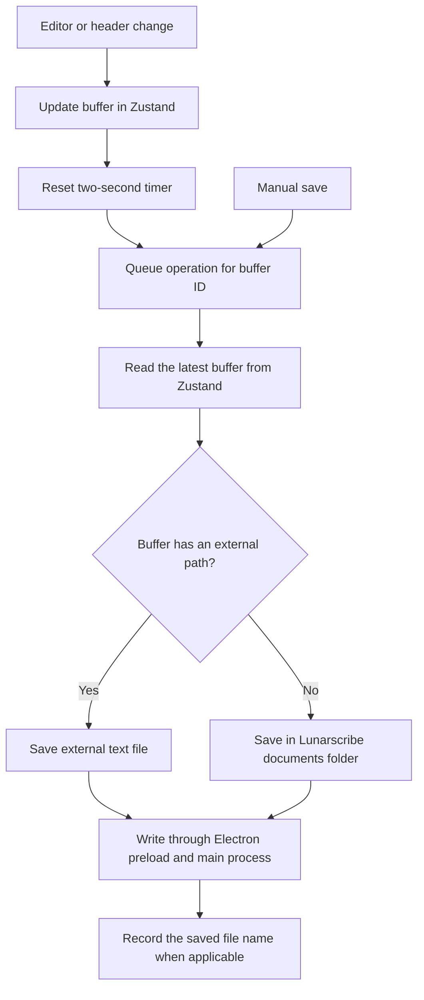

# File saving, renaming, and removal

Lunarscribe keeps each open buffer in Zustand. A save writes the buffer's markdown, or
drawing scene JSON, to a file on disk. This document describes the current save code and
the effect of Rename, Remove, and Delete.

## Save destinations

| Buffer                                 | Store fields                                            | Save destination                                                   |
| -------------------------------------- | ------------------------------------------------------- | ------------------------------------------------------------------ |
| New buffer                             | `fileName: null`, `externalPath: null`                  | The first save creates a file in the Lunarscribe documents folder. |
| Buffer for a file in Notes or Drawings | `fileName` holds the saved name; `externalPath: null`   | `app.getPath("documents")/lunarscribe/<name>`.                     |
| External buffer                        | `fileName: null`; `externalPath` holds an absolute path | The original external text file.                                   |

The system supplies the Documents folder path. New markdown buffers use `.md`. New drawing
buffers use `.draw`. Later saves retain a supported file extension. External text files
can use `.md`, `.markdown`, or `.txt`.

An external entry also has a `sourcePath`. This is the path used to open the file. Its
`path` is the canonical path returned by `realpath()`, which resolves symbolic links. The
buffer uses this canonical path for saves. The source path lets Lunarscribe reopen or
rename a symbolic link with a supported extension.

## When a save starts

| Trigger                               | Behavior                                                                                                               |
| ------------------------------------- | ---------------------------------------------------------------------------------------------------------------------- |
| An editor change                      | `setContent()` updates Zustand and starts or resets that buffer's two-second save timer.                               |
| A buffer title change in the header   | `renameBuffer()` updates the title and resets the same save timer. The header title is read-only for external buffers. |
| `Ctrl+S` on Linux or `Cmd+S` on macOS | `saveActiveBuffer()` cancels the active buffer's timer and requests a save immediately. A toast reports the result.    |
| Rename in a sidebar context menu      | The rename operation starts when the user submits the dialog. See the rename sections below.                           |
| Remove for an open external buffer    | The operation requests a final save before it removes the buffer.                                                      |
| Window close                          | The `beforeunload` handler flushes all buffer save timers.                                                             |

Each buffer has its own timer. An edit to one buffer does not reset another buffer's
timer. Selecting a different buffer does not cancel a pending save.

An automatic save skips a new buffer if its markdown or drawing data is empty after
trimming. A manual save can create an empty file. Once a buffer has a saved file, an
automatic save can write an empty string to that file.

The window-close handler starts pending saves but does not await their completion. A
window close or process exit can interrupt those writes.

## Save flow and write order

The buffer writer in `stores/file-writes.ts` uses `queueBufferWrite()` to put save,
rename, and delete operations for an open buffer in order. Its key is the buffer ID, which
stays the same after a rename. Each operation waits for the previous operation for that
buffer. A failed operation does not prevent the next operation from running.

Saved-file opens, sidebar renames, and deletion share a queue for each saved file name.
Each waits for launch restoration before it checks for an open buffer. A rename or
deletion waits for earlier reads before it changes the file. This prevents a delayed read
from adding a buffer with a name that has already been renamed or deleted.

External opens, renames, and removals share request order. This keeps selection order
stable and prevents a Remove from missing a buffer whose read is still pending. File
operations then enter the matching buffer's write queue, if the buffer is open. These
queues use one `createOperationQueue()` implementation, with identities appropriate to
each stage.

`applyFileOperation()` names the save and close policy in one table:

| Operation       | Before the disk operation                                 | After success                             |
| --------------- | --------------------------------------------------------- | ----------------------------------------- |
| Saved Rename    | Keep pending edits; save after the title changes.         | Keep the buffer open.                     |
| External Rename | Flush the buffer's latest markdown.                       | Keep the buffer open and update its path. |
| Delete          | Wait for earlier saves; discard edits still on the timer. | Cancel the timer and close the buffer.    |
| Remove          | Flush the buffer's latest markdown.                       | Cancel the timer and close the buffer.    |

A failed operation retains the buffer and its save timer. A failed saved Rename restores
the old title unless a newer header edit has changed it. This prevents a failed Rename
from being retried under the new title by an unrelated autosave.

`writeBuffer()` reads the buffer when its queued operation starts. If the buffer has been
removed, it returns `status: "closed"` without a disk write. An automatic save of an empty
new buffer returns `status: "empty"`. This prevents later queued saves from recreating a
deleted file or saving a removed external buffer.

The preload bridge sends file requests to the Electron main process. The renderer does not
use Node file APIs directly.

### Files in the Lunarscribe documents folder

`files:save` receives the previous file name, buffer title, extension, and markdown or
drawing data. It performs these steps:

1. Trim the title and replace slashes with underscores. Use `untitled` if the result is
   empty.
2. Build `<title><extension>`.
3. If that name belongs to another existing file, try `<title>_1`, `<title>_2`, and
   subsequent suffixes. The buffer's previous file name can be reused.
4. Write the data to the selected path.
5. Remove the previous path if the saved name changed.
6. Return the saved name. The writer records it in `fileName` and updates the title to
   include a collision suffix, unless a newer header edit has changed the title.

The main process orders saved-file reads, saves, and deletion in one folder queue. This
keeps two concurrent saves from selecting the same unused name. It does not prevent
another application from changing files in that folder.

The folder watcher sends an updated file list after 100 milliseconds without another
folder change. The sidebar uses that list for Notes and Drawings.

### External text files

`external-files:save` writes the buffer's markdown to `externalPath`. The main process
also puts writes in order for each canonical path.

The path must have been opened through the external-file bridge. Before a write, the main
process checks that the path still resolves to itself and is a file. A missing file or a
path changed into a symbolic link causes the save to fail. The save does not recreate a
missing external file.

The checks do not detect edits made by another application to an existing file. A save
writes the markdown currently held in the buffer.

## Rename a file in Notes or Drawings

The header and sidebar use different rename flows:

| Action                           | Disk change                                                                                     | Store change                                                                         |
| -------------------------------- | ----------------------------------------------------------------------------------------------- | ------------------------------------------------------------------------------------ |
| Edit the header title            | The next automatic or manual save writes under the new title and removes the previous path.     | The title changes immediately. `fileName` changes after the save succeeds.           |
| Submit the sidebar Rename dialog | `renameFile()` requests a save under the new title immediately, then removes the previous path. | An open buffer keeps its ID and updates both its title and `fileName` after success. |

Both flows use lowercase titles. Whitespace and slashes become underscores. The existing
extension remains in use. An existing destination name causes the save code to select a
numeric suffix.

For an open buffer, sidebar Rename waits for earlier writes and saves the markdown or
drawing data held in memory. For a file without an open buffer, it reads the file and
saves that data under the new name. It does not change the active buffer.

For example, rename `draft.md` to `Final Draft` in the sidebar. The requested name becomes
`final_draft.md`. If that name is already in use, the save code selects
`final_draft_1.md`, or the next available suffix. Later saves use the returned file name.

## Rename an external file

External Rename changes the name on disk in the same folder. It retains the source file's
extension and preserves the entered case and spaces. The name must be nonempty and must
not contain slashes or a null character. An existing destination causes an error instead
of a numeric suffix.

`renameFile()` with an external target performs these steps:

1. Wait for launch restoration and pending external-file open requests.
2. If the buffer is open, wait for its earlier writes and save its current markdown. A
   failed save stops the rename.
3. Read the source file through the bridge to permit the main process to rename it. This
   also supports tracked entries not yet opened in this launch.
4. Verify that the source path still resolves to the tracked canonical path and that its
   target is a file.
5. Create the new source entry without overwriting an existing destination. Use a hard
   link where supported to preserve the inode. Otherwise, copy a regular file with
   `COPYFILE_EXCL`, or create a symbolic link with the same target. Resolve the new
   canonical path, then unlink the old source path. If this step fails, attempt to remove
   the new entry.
6. Update the tracked entry's `name`, `path`, and `sourcePath`. Update an open buffer's
   title and `externalPath`.

The explicit symbolic-link fallback is necessary. Node's `cp()` implementation can unlink
an existing symbolic-link destination even with `force: false` and `errorOnExist: true`.
The rename must refuse that collision. See the
[Node copy implementation](https://github.com/nodejs/node/blob/v26.10.0/lib/internal/fs/cp/cp.js#L340-L392).

For a symbolic link, the source entry is renamed and its target stays in place. For a
regular file, the canonical path changes to the new file name. Later saves use the updated
canonical path. The operation preserves the buffer ID and active selection. External saves
and renames also share one main-process queue per canonical path. A second rename using a
stale source path fails after the first rename completes.

For example, rename `/home/alex/work/draft.txt` to `Final Draft`. The new source path is
`/home/alex/work/Final Draft.txt`.

## Remove an external entry

Remove applies to the External files section. It removes the tracked entry and its open
buffer from Zustand. It leaves the external file on disk.

`removeExternalFile()` waits for launch restoration and pending external open requests. If
a matching buffer is open, it performs these steps in that buffer's write queue:

1. Attempt a final save of the buffer's current markdown.
2. If the save fails, reject Remove and show an error toast. Keep the buffer, its
   markdown, its save timer, and the tracked external entry.
3. Cancel and discard the buffer's save timer.
4. Remove the buffer and its tracked external entry.

If the buffer is not open, Remove only removes the tracked entry. It does not attempt a
save or read the external file.

If Remove affects the active buffer, the store selects an untouched welcome buffer or
creates one. Delete uses the same fallback. Otherwise, the active buffer stays selected.
The removed entry is also removed from the persisted external list. Opening the file again
adds it to that list again.

## Delete a file in Notes or Drawings

Delete requires confirmation and removes the file from disk. For an open buffer, it waits
for earlier writes and uses the buffer's latest `fileName`. This accounts for a save that
changed the name before Delete could run.

After deletion succeeds, the store cancels the timer and removes the buffer. Later queued
saves find no buffer and do no work. Deleting the active buffer selects an untouched
welcome buffer or creates one. Deleting another buffer keeps the active selection.

A failed delete leaves the buffer open and reports the error in the confirmation dialog.
External entries have Remove instead of Delete.

## Persistence and failure behavior

Zustand persists `externalFiles`, `lastOpenedFileName`, and `lastOpenedExternalPath` under
`lunarscribe-buffers`. It does not persist open buffers or their markdown. On launch,
Lunarscribe reads the last selected file from disk. Store changes after rename, Remove, or
Delete update that saved selection.

Automatic save failures, manual save results, saved-file open failures, failed Remove, and
clipboard results use toasts with operation-specific titles. A failed Rename or Delete
stays in its action dialog so the user can retry. Copy path reports success in a toast.

`fileError` contains only failed external opens, including a launch restore failure. The
page alert includes each path and remains visible until the user selects Dismiss or opens
another external-file batch. An unrelated successful save does not clear that alert.

A failed drawing-editor load shows a separate alert. It tells the user to save open
buffers and restart Lunarscribe. The load failure does not update the buffer's scene or
start a save.

Disk operations use `writeFile()`, links, exclusive copies, and removal calls. They do not
form one atomic transaction. A failed write can leave a partial file. If removal of an old
path fails after a successful write, both names can remain on disk. External Rename uses
an exclusive-copy fallback when the filesystem does not support hard links.

## Web app

The web app uses the same buffer store, write queues, save timers, and file-operation
policies as the desktop app. Only the save destinations are different. The browser does
not give file paths to the page, and there is no Electron main process. Thus the app keeps
saved files in IndexedDB and opens external files through file handles.

| Buffer                                 | Store fields                                             | Save destination                                          |
| -------------------------------------- | -------------------------------------------------------- | --------------------------------------------------------- |
| New buffer                             | `fileName: null`, `externalId: null`                     | The first save creates a record in browser storage.       |
| Buffer for a file in Notes or Drawings | `fileName` holds the saved name; `externalId: null`      | The record with that name in the IndexedDB `files` store. |
| External buffer                        | `fileName: null`; `externalId` holds a generated file ID | The original file, through its stored file handle.        |

### Saved files in browser storage

The IndexedDB database `lunarscribe` has a `files` object store. Each record is
`{ name, content, modifiedAt }`, and `name` is the key. The name is `<title><extension>`,
as in the documents folder. Saved files stay in this browser profile only. If the user
clears site data for Lunarscribe, the saved files are deleted. Use sync to keep a copy in
another location. Refer to [Syncing saved writing](features/001-syncing.md#web).

`saveFile()` in `saved-files.ts` uses the desktop naming rules: the trimmed title, an
underscore for each slash, `untitled` for an empty title, and a numeric suffix for a name
that another file uses. It does all the steps in one IndexedDB transaction. Thus the new
record and the removal of the previous name commit together or fail together.

The desktop app does not do this check: a save with an expected content first reads the
stored record. If the record is gone or its content changed, the save fails. The buffer
keeps its edits. This prevents a tab from overwriting a save from a different tab.

One operation queue orders all saved-file reads, saves, deletions, and sync downloads in a
tab. After a change, the tab sends a message on the `lunarscribe-saved-files`
BroadcastChannel. Each tab then reads the file list again and updates its sidebar. This
replaces the folder watcher.

Saved files have **Download** in place of Copy path. It downloads the file with its saved
name.

### External files

The File System Access API is available in Chromium browsers. In these browsers, external
files are file handles in the IndexedDB `external-files` store. Each handle has a
generated ID, because the browser gives no path. The header and sidebar show the file name
only. A user can add a file in these ways:

- Select **Open file** in the sidebar header.
- Drop a file on the editor.
- Open a `.md`, `.markdown`, or `.txt` file from the operating system in the installed
  app. The web app manifest declares these file handlers, and `launchQueue` receives the
  files.

If a handle points to the same file as a tracked handle, the app uses the tracked ID.

Before each read, write, or rename, the app asks for read and write access. The browser
shows a permission prompt only during a click or key press. After a reload, the app tries
to reopen the last external file without a click. This attempt usually fails, and the app
then clears the selection. Select the file in the sidebar to give access again.

`saveExternalFile()` writes through a writable stream and orders writes for each file ID.
If a write fails, the app stops the stream, and the file keeps its previous content. The
desktop path and symbolic-link checks do not apply.

External Rename uses `FileSystemFileHandle.move()`, which only Chromium has. It keeps the
extension and refuses an empty name. Remove deletes the handle record only. The file stays
on the device.

Firefox and Safari do not have the File System Access API. In these browsers, Open file
and drops copy each text file into browser storage as a new saved note. The app shows a
toast that edits stay in Lunarscribe. Later edits do not change the original file.

### Persistence and page close

Zustand persists `lastOpenedFileName` and `lastOpenedExternalId` under
`lunarscribe-buffers` in localStorage. The tracked external files come from IndexedDB, not
from this key.

IndexedDB writes are asynchronous, and a browser can stop a page at any time. Thus the app
starts all pending saves at these times:

- The tab becomes hidden.
- The page receives `pagehide`.
- The page receives `beforeunload`.

As on desktop, the app does not show a leave-page prompt and does not await these saves. A
page close can interrupt a write that is still in progress.

### Web code references

- [Browser database](../apps/web/src/lib/browser-database.ts): IndexedDB stores and
  transactions.
- [Saved files](../apps/web/src/lib/saved-files.ts): save names, conflict checks, and tab
  messages.
- [External files](../apps/web/src/lib/external-files.ts): file handles, permissions,
  writes, renames, and the file picker.
- [Buffer store](../apps/web/src/stores/buffer-store.ts): external opens, imports, and
  restore after reload.
- [Buffer writer](../apps/web/src/stores/file-writes.ts): save timers and page-close
  flushes.

## Code references and checks

- [Buffer store](../apps/desktop/src/stores/buffer-store.ts): file-operation policies,
  rename actions, removal, deletion, and persisted selection.
- [Buffer writer](../apps/desktop/src/stores/file-writes.ts): save timers and disk writes.
- [Operation queue](../apps/desktop/src/lib/operation-queue.ts): shared serialization.
- [Documents folder](../apps/desktop/src/electron/documents-folder.ts): save names, disk
  writes, deletion, and sidebar file-list updates.
- [External files](../apps/desktop/src/electron/external-files.ts): path checks, external
  writes, and external renaming.
- [Preload bridge](../apps/desktop/src/electron/preload.ts): renderer file API.
- [Save shortcut](../apps/desktop/src/components/use-save-shortcut.ts): manual save and
  result toasts.
- [App sidebar](../apps/desktop/src/components/app-sidebar.tsx): Rename, Remove, and
  Delete callbacks.

When changing this behavior, run `bun run format`, `bun run lint`, and
`bun run check-types`. Run `bun run build` for changes across packages.

These interaction checks remain manual. Use temporary files when app interaction checks
are requested:

1. Open a saved file and immediately Delete it. The read completes before deletion. The
   buffer closes and does not reappear after two seconds. Delete during an earlier save
   must use the name returned by that save.
2. Open a saved file and immediately Rename it. The original extension and latest markdown
   remain. No delayed read adds a second buffer with the old name.
3. Edit a buffer, then Rename or Remove it before the two-second timer fires. External
   Rename saves the edit and later saves use the new path. Remove saves the edit, retains
   the disk file, and cancels the timer.
4. Force a save or deletion failure, then retry. The failed operation retains the buffer
   and its markdown. A rejected queue entry must not block the retry. A failed saved
   Rename must not change the name on a later autosave.
5. Rename two saved files to the same title while saves are pending. Their markdown stays
   separate and the second name receives a suffix. The displayed title includes that
   suffix.
6. Rename an external file to an existing regular file or symbolic link. The existing
   destination must remain unchanged. Rename a relative symbolic link to an unused name;
   its link target must remain unchanged and later saves must reach the same target.
7. Request two external renames of the same original path. The second request must fail
   after the first completes, with no extra destination left behind. Check a no-op rename
   followed by a save as well.
8. Open an external file and immediately Remove it. Remove waits for the read, then
   removes the buffer and tracked entry. Remove an inactive entry; the active buffer stays
   selected.
9. During launch restore, request a different file. The requested file wins the selection.
   Load sidebar settings that omit section keys; those sections stay open and explicit
   closed sections stay closed.
10. Hold `Ctrl+S` or `Cmd+S`. One save starts; repeated key events do not open Electron's
    default save dialog. An empty new buffer can still be saved manually.
11. Force clipboard and external-open failures. Clipboard failure uses a toast and does
    not leave a page alert. Failed external paths remain visible until Dismiss or another
    batch.
12. Open row actions with both right-click and the action button. Only one menu stays
    open, it uses the correct anchor, and closing restores focus to the action button.
13. Create a drawing and open a saved `.draw` file. Both show the canvas. Switch to a
    markdown buffer while the drawing editor loads; the late load must not replace it.
14. In a temporary production build, make the drawing JavaScript or CSS chunk unavailable
    before its first load. Create a drawing or open a saved `.draw` file. The page shows
    "Unable to load drawing editor" and restart instructions. The failure does not change
    the buffer's scene or produce an unhandled promise rejection. Restore the chunk,
    restart, and verify that both drawing paths show the canvas.
