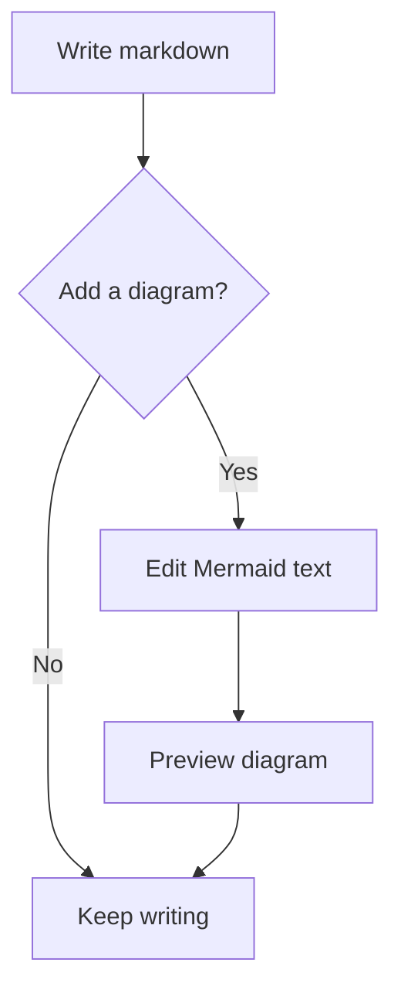

# Mermaid blocks

The markdown editor renders Mermaid definitions as diagrams. Select **Insert Mermaid
block** in the toolbar, or use a fenced `mermaid` block. The definition remains part of
the buffer's markdown, so users can edit and copy it without extracting text from a
diagram.

## Insert and edit

The toolbar uses selected text as the definition. With no selected text, it inserts a
small flowchart. The new block opens for editing.

Type three backticks followed by `mermaid` on a separate line, then press Enter. This
markdown shortcut opens an empty Mermaid block. It applies to paragraphs directly inside
the markdown editor. Loading or pasting a complete fenced definition also creates a
Mermaid block.

Click a diagram to show its definition in a source field, with the preview below it.
Moving focus elsewhere closes the source field and leaves the preview visible. The source
field uses the native caret. Its keys do not also trigger markdown shortcuts.

| Action                                       | Result                                                                  |
| -------------------------------------------- | ----------------------------------------------------------------------- |
| Enter in the source field                    | Insert a new line in the definition.                                    |
| Escape or Ctrl+Enter / Cmd+Enter             | Close editing and move to the next block. Create a paragraph if needed. |
| Backspace or Delete with an empty definition | Replace the Mermaid block with an empty paragraph.                      |
| Ctrl+Z / Cmd+Z                               | Undo through the markdown editor history.                               |
| Ctrl+Y or Ctrl+Shift+Z / Cmd+Shift+Z         | Redo through the markdown editor history.                               |

Ordinary code blocks wait for both typed fences before conversion. Mermaid keeps its
opening-fence shortcut because its separate source field supports multiline editing.

## Example

Paste this complete block into the markdown editor:

````markdown

````

## Rendering and storage

`MermaidNode` stores the definition. Markdown import and export use Mermaid transformers.
Import accepts backtick or tilde fences. Export uses a backtick fence longer than any run
of backticks in the definition.

`MermaidComponent` owns source-field focus and edit state. Its preview button remains
mounted during editing. Mouse presses on that button preserve source-field focus until the
click handler selects the block. This prevents editing from immediately closing.

`MermaidPreview` loads Mermaid on demand. It schedules rendering 150 milliseconds after
the latest edit. Rendering runs in a shared queue because Mermaid has shared
configuration. Revision checks prevent an older result from replacing a newer preview. The
preview updates when the theme or appearance styles change.

Mermaid uses strict rendering with its error graphic disabled. Invalid definitions show
error text in the preview. Empty definitions show a prompt. SVGs use responsive widths and
automatic heights; toolbar button icon styles must not constrain diagram dimensions.

Exports with Mermaid blocks use a read-only markdown snapshot. The snapshot waits for
pending diagrams before export. The desktop export path has a 15-second render timeout.
Editing controls are outside that snapshot. The scope covers Mermaid blocks in the
markdown editor; it does not add a separate diagram editor or change Excalidraw drawings.

## Validation and acceptance

Run `bun run format`, `bun run lint`, `bun run check-types`, and `bun run build` to
validate changes. Interactive checks have not been run.

Acceptance requires toolbar insertion, the markdown shortcut, paste, and reload to produce
editable diagrams. A click must keep editing open. Moving focus elsewhere must leave only
the preview. Invalid definitions must retain their text. Rapid edits must show the newest
definition. Preview dimensions must remain readable after a click. Export must wait for
rendering and exclude source controls.
