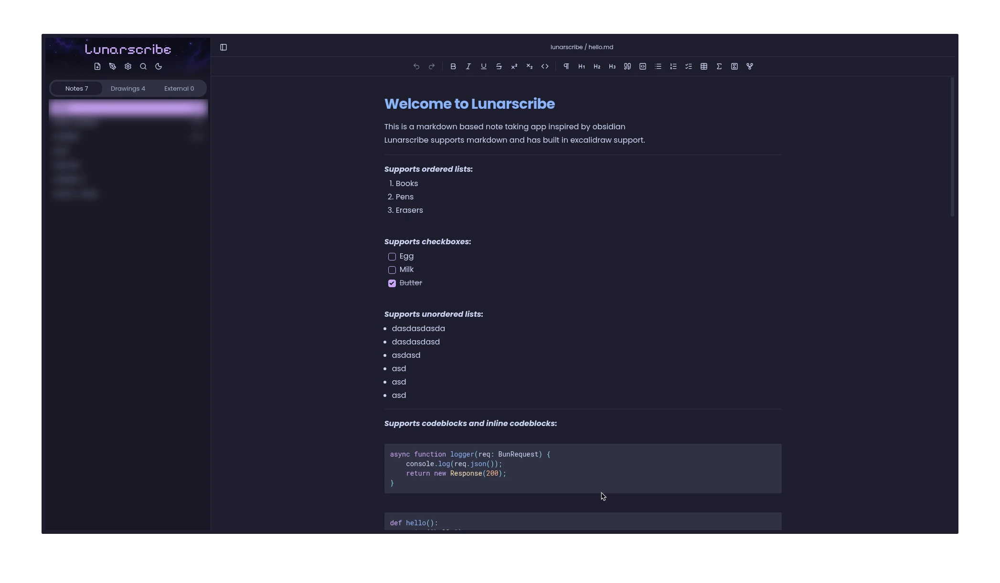
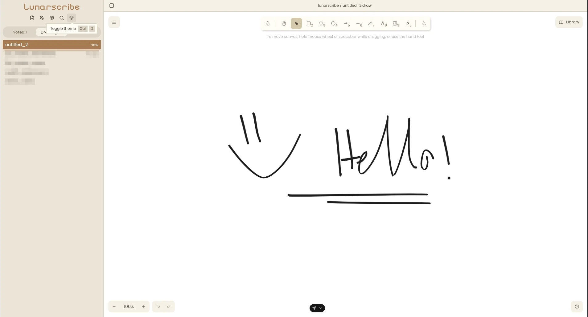

# Lunarscribe

Lunarscribe is a desktop markdown writing app for Linux and Apple Silicon Macs. The
markdown editor shows formatted text as you type. The app has a formatting toolbar, local
file storage, Excalidraw drawings, and PDF and DOCX export.





## Features

- **Markdown editor:** Markdown shortcuts apply headings, quotes, bulleted lists, numbered
  lists, checkbox lists, code blocks, links, and horizontal rules. Code blocks show syntax
  highlighting.
- **Checkbox lists:** Completed items move below incomplete items. An animation shows the
  change in item order.
- **Inline formats:** The editor supports bold, italic, underline, strikethrough,
  superscript, subscript, and inline code. The toolbar shows the inline formats of the
  selected text. It also has undo and redo controls.
- **Tables:** The toolbar has a control to insert tables. The editor also loads markdown
  tables. Each cell has an action menu to insert or delete rows and columns, or delete the
  table. In a cell, the right-click menu has the same actions under Table. Wide tables
  have horizontal scroll controls inside the editor.
- **Links:** Type `[text](url)` or use the toolbar's link control to add a link with its
  own text. With the caret in a link, a bar under it shows the URL and can edit or remove
  the link. Ctrl+click (⌘+click on macOS) opens a link.
- **Collapsible headings:** Hovering a heading shows a chevron that collapses everything
  under it until the next heading of the same or a higher level.
- **Right-click menu:** A right-click in the editor opens a menu like Obsidian's, with
  link actions, Format, Paragraph, Insert, and Table submenus, undo and redo, and
  clipboard actions. Settings → Appearances can hide the toolbar, since the menu holds all
  of its actions.
- **Math:** KaTeX shows LaTeX equations as inline math or math blocks. The toolbar has
  controls to insert both types. The editor also converts `$...$`, `$$...$$`, and pasted
  markdown equations to math. You can edit the LaTeX source of a selected equation.
- **Drawings:** The app has an Excalidraw canvas to create and edit drawings. Lunarscribe
  saves drawing scenes as local `.draw` files.
- **Frontmatter:** A buffer's markdown can start with frontmatter, a block of YAML
  metadata between `---` fences. The frontmatter panel above the editor lists the block as
  one row per key and value pair, with an editor for each value's type: text, number,
  checkbox, or a list of text. The panel adds, renames, and removes rows. Removing the
  last row removes the block from the file. Frontmatter never appears as writing and is
  left out of exports.
- **Local storage:** Lunarscribe automatically saves changes two seconds after the last
  edit. The save shortcut saves the active buffer immediately. When the app starts, it
  opens the last selected saved file.
- **Syncing:** Settings → General → Syncing connects GitHub, Google Drive, or Dropbox.
  Saved markdown and drawings sync every five minutes while the app is open. The save
  shortcut also pushes the active saved file. Successful sync shows a message beside the
  file path for three seconds. Conflicts and sync failures show toasts. Google Drive and
  Dropbox use browser sign-in and renew access automatically. Refer to
  [Syncing saved writing](docs/features/001-syncing.md) for setup and conflict behavior.
- **External files:** The editor opens `.md`, `.markdown`, and `.txt` files. You can drag
  files into the markdown editor or give their paths to the desktop app. Packaged apps
  support file associations and `lunarscribe://open?path=...` links. Lunarscribe saves
  changes to the original file.
- **Sidebar:** The sidebar has Notes, Drawings, and External files sections. Each section
  shows its file count and has separate scroll controls. The app keeps the sidebar
  visibility and section settings between app starts. File actions are Rename, Copy path,
  Delete for saved files, and Remove for external entries. **Force changes to remote**
  replaces a saved file's remote copy with the local copy for any connected provider.
  Delete requires confirmation.
- **Search:** Find shows matching text in the active buffer. It has controls for case
  matching, whole-word matching, and the next and previous matches. The fff search finds
  saved files by name or text. Results show highlighted matches and line previews.
- **PDF and DOCX export:** The sidebar has actions to export text files. For an open
  buffer, exports use the current edits. Exports use the selected theme and fonts. They
  keep formatted text, tables, code, and equations.
- **Appearance:** The default themes are a warm paper light theme and Catppuccin Mocha
  dark theme. Each theme can have a separate color theme. The interface, buffer writing,
  and code can use different fonts. Available fonts are Poppins, Roboto Mono, Pixelify
  Sans, and installed system fonts. The app keeps appearance settings between app starts.
- **Offline use:** The app includes its fonts, KaTeX fonts, and Excalidraw fonts. These
  fonts support writing, equations, and drawings without a network connection.

## Install

Run this command to install or update Lunarscribe:

```sh
curl -fsSL https://raw.githubusercontent.com/anargia-pixels/lunarscribe/main/install.sh | bash
```

The installer downloads the latest release and checks its SHA-256 checksum. It requires
Bash, curl, and jq. Linux also requires `unzip` and `sha256sum`.

- **Linux x86_64:** The app installs to `~/.local/lunarscribe.app/`. Its desktop entry is
  `~/.local/share/applications/lunarscribe.desktop`. Select Lunarscribe in your
  application menu to start the app.
- **macOS Apple Silicon:** The app installs to `~/Applications/Lunarscribe.app`. Open this
  app to start it. The release uses an ad-hoc signature and has no Apple notarization.
  macOS can require approval in System Settings → Privacy & Security before the first
  start.

Repeat the command to update the app. On Linux, the installer replaces the application
folder. If you set `XDG_DATA_HOME`, the desktop entry uses that directory's
`applications/` folder.

To change the install location, export `LUNARSCRIBE_INSTALL_DIR` before the command. On
Linux, this path is the application folder. On macOS, this path is the parent of the
application folder. To install a specific version, export `LUNARSCRIBE_VERSION`, such as
`v0.0.13`.

You can also download the Linux ZIP or macOS DMG from
[GitHub Releases](https://github.com/anargia-pixels/lunarscribe/releases).

## Run from source

Use Linux x86_64 or an Apple Silicon Mac with Bun 1.3.14. The root `package.json`
specifies this Bun version. The app does not support Windows yet.

```sh
git clone https://github.com/anargia-pixels/lunarscribe.git
cd lunarscribe
bun install
env -u ELECTRON_RUN_AS_NODE bun run dev:desktop
```

The desktop development command installs the Electron runtime before it starts the app.
The `env -u ELECTRON_RUN_AS_NODE` command removes this environment variable for the app
process. If this variable is set, Electron can run as Node.js instead of the desktop app.

## Use Lunarscribe

1. Select the new markdown buffer button in the sidebar. This button creates a buffer for
   writing.
2. Type markdown shortcuts or use the toolbar to apply formats. For example, type `## `
   for a heading or `> ` for a quote.
3. Press `Ctrl+S` on Linux or `Cmd+S` on macOS to save the active buffer immediately. The
   app also automatically saves changes after two seconds without edits.
4. Select a saved entry in the sidebar to open it.

To create a drawing, select New drawing in the sidebar.

To edit an external text file, drag it into the markdown editor. The file appears under
External files. The app saves edits to the original path.

To rename a file:

1. Open the file's action menu with a right-click or the ellipsis button.
2. Select Rename.
3. Enter the new name in the dialog.
4. Confirm the new name.

To export a text file:

1. Open the file's action menu with a right-click or the ellipsis button.
2. Select Export as PDF or Export as DOCX.
3. Select the destination in the save dialog.
4. Save the export.

To change color themes and fonts, open Settings → Appearances. To change between the light
and dark themes, use the dark mode toggle in the sidebar.

### Markdown extensions

Lunarscribe uses the syntax below for inline formats and math. Other markdown readers can
show different results for this syntax.

| Syntax                    | Format        |
| ------------------------- | ------------- |
| `**bold**`                | Bold          |
| `*italic*`                | Italic        |
| `__underline__`           | Underline     |
| `~~strike~~`              | Strikethrough |
| `^superscript^`           | Superscript   |
| `~subscript~`             | Subscript     |
| `$x^2$`                   | Inline math   |
| `$$x^2$$` on its own line | Math block    |

To insert a math block with multiple lines:

1. Type `$$` on a separate line.
2. Press Enter.
3. Enter the LaTeX source.

To insert a horizontal rule, type `---` on a separate line and press Enter.

### Keyboard shortcuts

| Action                | Linux    | macOS         |
| --------------------- | -------- | ------------- |
| Save active buffer    | `Ctrl+S` | `Cmd+S`       |
| Find in active buffer | `Ctrl+F` | `Cmd+F`       |
| Search saved files    | `Ctrl+E` | `Ctrl+E`      |
| Bold                  | `Ctrl+B` | `Cmd+B`       |
| Italic                | `Ctrl+I` | `Cmd+I`       |
| Underline             | `Ctrl+U` | `Cmd+U`       |
| Undo                  | `Ctrl+Z` | `Cmd+Z`       |
| Redo                  | `Ctrl+Y` | `Cmd+Shift+Z` |

In Find, press Enter to select the next match. Press Shift+Enter to select the previous
match. Press Escape to close Find.

In saved-file search, use the arrow keys to select a result. Press Enter to open the
selected file. Select Content to search for text inside saved files.

Saved-file search shows a maximum of ten results from the Lunarscribe documents folder. It
does not search external files.

### Where writing is saved

Lunarscribe saves new markdown buffers as `.md` files and drawings as `.draw` files. These
files are in the `lunarscribe/` folder inside the system Documents folder. The usual path
is `~/Documents/lunarscribe/`.

For a new empty buffer, the save shortcut creates an empty file. An automatic save creates
the file after you add writing or drawing data.

External text files stay at their original paths. Remove saves pending edits and removes
the external entry from the sidebar. The file stays on disk. After confirmation, Delete
removes a saved file from the Lunarscribe documents folder.

Refer to [File saving, renaming, and removal](docs/001-file-saving.md) for save behavior
and file operation details.

## Development

The project uses Bun and Turborepo to manage its workspaces. It uses React, TypeScript,
Electron, Lexical, Tailwind CSS, and shadcn components.

| Location              | Purpose                                                      |
| --------------------- | ------------------------------------------------------------ |
| `apps/desktop`        | Electron desktop app, app state, themes, and file operations |
| `apps/web`            | TanStack Start generator boilerplate                         |
| `packages/components` | Shared UI, markdown editor, and drawing editor               |
| `packages/utils`      | Shared libs and bundled fonts                                |
| `tools/oxlint`        | Custom lint rules                                            |

Run the repository checks from the project root:

```sh
bun run format
bun run lint
bun run check-types
```

To build release packages, run the command for the target operating system:

```sh
bun run package:linux
bun run package:macos:arm64
```

Run the macOS command on an Apple Silicon Mac. Packages are in `apps/desktop/dist/`. A
version tag, such as `v0.0.13`, starts the GitHub Actions release workflow. The workflow
builds both packages and publishes them with their checksums. To build an existing release
again, run the Release workflow manually and enter its tag. The workflow replaces that
release's packages. A push to `main` does not start a release.

The root `package.json` catalog specifies dependency versions. Workspaces use `catalog:`
references. Refer to [AGENTS.md](AGENTS.md) for repository conventions. Refer to
[GLOSSARY.md](GLOSSARY.md) for product and codebase terms.
